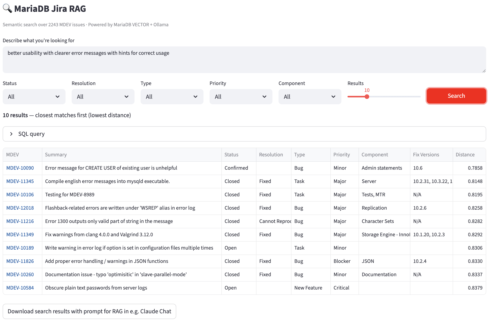

# MariaDB Jira RAG

This project pulls **MDEV** issues from [MariaDB Jira](https://jira.mariadb.org), stores them as JSON on disk, **embeds** text locally with **Ollama** (`nomic-embed-text`), and writes vectors into a **MariaDB** database that supports **vector similarity search**. A **Streamlit** app runs semantic search with filters and optional **export** of results for tools like Claude Chat.

**What you can do**

- **Fetch** issues from the public Jira REST API into `data/issues/MDEV-*.json` (incremental: newest first, then backfill older keys). Each file stores a **subset of Jira fields** (see `FIELDS` in `fetch_jira.py`—summary, description, status, resolution, issue type, priority, components, fix versions, dates, comments, etc.).
- **Load** JSON into MariaDB: one row per issue plus one **`issue`** embedding chunk. What is embedded is spelled out under [Loading MariaDB](#loading-mariadb) (summary + description + comments, cleaned, then **up to the first 8000 characters** of that cleaned text for the vector). Re-fetch JSON after changing `FIELDS` so new keys (e.g. `issuetype`) appear on disk.
- **Search** in the browser: natural-language query, filters (status, resolution, type, priority, component), vector distance ranking, links to Jira, collapsible SQL, and a download button (**Download search results with prompt for RAG in e.g. Claude Chat**) that saves JSON with **`task_for_claude`**, your query, filters, and full issue JSON per hit.

Pipeline: **fetch Jira JSON → embed with Ollama → MariaDB → search / export in the Web UI.**

---

## Screenshot of Web UI 



---

## On MacBook

If you use [Homebrew](https://brew.sh), install MariaDB and Ollama (skip any you already have):

```bash
brew install mariadb ollama
```

Start MariaDB and create the database (adjust user/password to match your setup):

```bash
brew services start mariadb
mariadb -u root -e "CREATE DATABASE IF NOT EXISTS jirarag;"
```

Pull the embedding model and install Python dependencies:

```bash
ollama pull nomic-embed-text
pip install streamlit mariadb ollama requests
```

Ensure **Ollama is running** (e.g. the default `ollama serve` / menu app) whenever you load data or use the search UI.

**Database connection:** `fetch_jira.py` only needs the filesystem. `load_mariadb.py` and `search_app.py` use `DB_CONFIG` at the top of each file (Unix socket, user, password, database `jirarag`). Point these at your MariaDB user and socket path—by default they match a typical Homebrew MariaDB layout on macOS (`/tmp/mysql.sock`).

**`--rebuild` and open connections:** Stop **Streamlit** (and other clients using `jirarag`) before `python load_mariadb.py --rebuild`, or `DROP TABLE` can block on locks.

---

## Fetching Jira JSON

Writes one file per issue under `data/issues/`. Uses `data/fetch_state.json` to remember fetch history.

| Command | Description |
|--------|-------------|
| `python fetch_jira.py newest [N]` | Fetch the **N** most recently updated issues (default **100**). Good for first import or catching up on recent changes. |
| `python fetch_jira.py backfill [N]` | Fetch **N** older issues starting from below the oldest key already on disk (default **500**). Repeat to grow history. |
| `python fetch_jira.py status` | Show counts, key range, gaps, and last fetch metadata. |

Examples:

```bash
python fetch_jira.py newest 1000    # initial grab of latest 1000
python fetch_jira.py backfill 2000  # add 2000 older issues
python fetch_jira.py newest 200     # periodic sync of recent updates
python fetch_jira.py status
```

`newest` uses JQL ordered by **`updated DESC`**, so it refreshes the most recently touched tickets first (good for picking up new API fields after you change `FIELDS`).

---

## Loading MariaDB

### What gets embedded (for the vector)

The model sees **one string per issue**, built in this order from the JSON on disk:

1. **Summary** (title)  
2. **Description**  
3. **Comment bodies** — each `fields.comment.comments[].body`, in order (only comments **included in that file**; Jira may paginate)

Then **`clean_for_embedding()`** in `load_mariadb.py` normalizes that combined text:

- Removes Jira **`{code}…{code}`**, **`{noformat}…{noformat}`**, and **`{quote}…{quote}`** blocks (so large code / log dumps are dropped for embedding)  
- Collapses Java-style **stack trace** lines  
- Replaces long **hex** runs with a placeholder  
- Collapses **whitespace** to single spaces  

The embedding call uses **the first 8000 characters** of that **cleaned** string (so anything after 8k is not in the vector). If Ollama fails on that length, the loader retries with **4000**, then **2000** characters; the run summary says how many issues needed a shorter fallback.

The **`chunks.content`** column still stores the **raw** combined text (before clean/truncate) for reference; only the **vector** is derived from cleaned + truncated text.

Otherwise: the loader reads `data/issues/MDEV-*.json`, embeds as above, and upserts rows into `jirarag`.

| Command | Description |
|--------|-------------|
| `python load_mariadb.py` | Load any JSON files **not yet** present in the database (skips existing keys). Creates tables if missing. |
| `python load_mariadb.py --rebuild` | **Drop** `issues` / `chunks`, recreate schema, and **reload all** JSON files from disk. |
| `python load_mariadb.py --status` | Print issue/chunk counts, key range, top statuses, and how many JSON files are still unloaded. |

Examples:

```bash
python load_mariadb.py --status
python load_mariadb.py
python load_mariadb.py --rebuild
```

**Comments in Jira JSON** may be paginated (`fields.comment.total` vs length of `comments`); only what the API returned in that file is included in the combined text above.

---

## Run the Web UI

From the project directory:

```bash
streamlit run search_app.py
```

Open the URL Streamlit prints (usually `http://localhost:8501`). Enter a query, set filters, click **Search**. After results, use **Download search results with prompt for RAG in e.g. Claude Chat** to save JSON (includes `task_for_claude`, `user_query`, `filters_at_export`, and `search_hits` with full per-issue JSON from `data/issues/`). Run Streamlit from the repo root so those paths resolve.

---

## Extra script

| Command | Description |
|--------|-------------|
| `python count_issue_text.py [threshold]` | For each `MDEV-*.json`, count **cleaned** characters for summary + description + comment bodies; report how many exceed `threshold` (default **4000**). |

---

## Requirements

- **Python 3** with the packages above.
- **MariaDB** with vector support compatible with this schema (see `load_mariadb.py` for `VECTOR` columns and indexes).
- **Ollama** with the **`nomic-embed-text`** model for both loading and search (same model must be used end-to-end).
